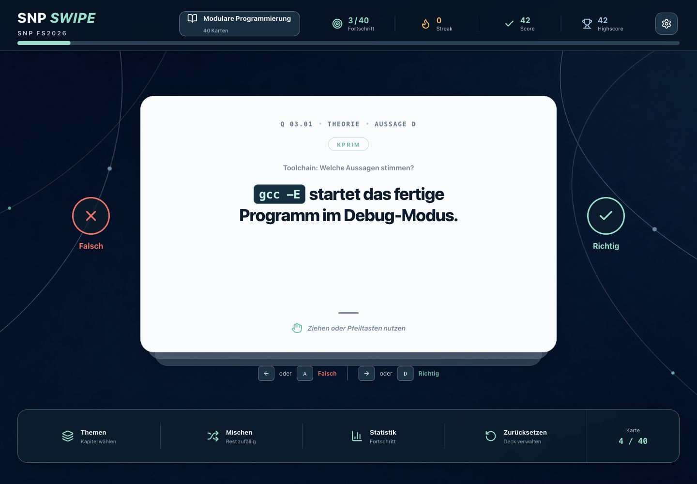

# SNP Swipe Trainer

Ein spielerischer, lokaler Swipe-Trainer zur Vorbereitung auf KPRIM-Fragen
im Modul Systemnahe Programmierung (SNP).

- 291 KPRIM-Fragen
- 1'164 einzelne Richtig/Falsch-Karten
- Swipe, Buttons und Tastatur (`A`/`←`, `D`/`→`)
- sofortige Erklärung nach einer falschen Antwort
- Themenfilter, Mischen und Wiederholungsqueue
- lokaler Fortschritt, Score, Streak und Highscore

## Screenshots



## Lokal starten

Voraussetzungen:

- Node.js 20 oder neuer
- npm

```bash
git clone https://github.com/fabi-wi/snp-swipe-trainer.git
cd snp-swipe-trainer
npm install
npm run dev
```

Die App läuft danach unter `http://127.0.0.1:5173/`.

## Produktions-Build

```bash
npm run build
```

## Kartensatz neu importieren

Der Importer benötigt `pdftotext`. Lege die Quelldatei standardmäßig unter
folgendem Namen im Projektordner ab:

```text
SNP_FS2026_Kprim_MC_Trainer_Design.pdf
```

Import mit Standardpfad:

```bash
npm run import:cards
```

Import mit einem anderen PDF:

```bash
npm run import:cards -- /absoluter/pfad/zum/trainer.pdf
```

Der Import bricht ab, falls nicht exakt 291 Fragen und 1'164 Karten erkannt
werden. Die abgeleiteten Daten liegen in `src/data/cards.json`.

## Speicherung

Der Lernstand wird ausschliesslich im Browser unter
`snp-swipe-trainer:v1` in `localStorage` gespeichert. In den Einstellungen
kann das aktuelle Deck neu gestartet oder der gesamte Lernstand gelöscht
werden.

## Mitwirken

Issues und Pull Requests sind willkommen. Für Änderungen am Kartensatz bitte
auch die betroffenen Erklärungen prüfen und sicherstellen, dass
`npm run build` erfolgreich durchläuft.

## Hinweise zu den Lerninhalten

Dies ist ein inoffizielles Lernprojekt und keine offizielle Publikation einer
Hochschule. Das ursprüngliche PDF ist nicht Teil dieses Repositories. Rechte an
zugrunde liegenden Kursunterlagen verbleiben bei den jeweiligen Urhebern.

## Lizenz

Der Quellcode steht unter der [MIT-Lizenz](LICENSE). Die in
`src/data/cards.json` enthaltenen Lerninhalte sind davon ausgenommen.
